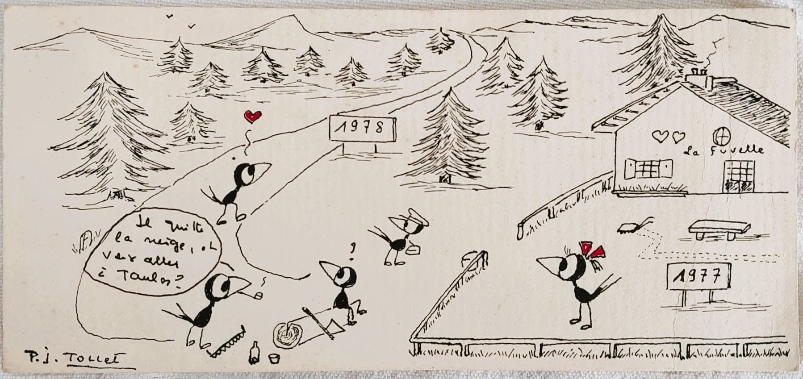
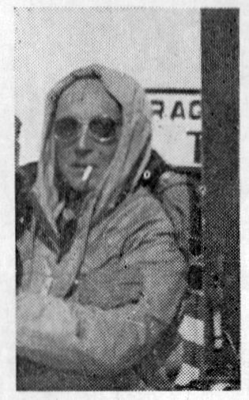
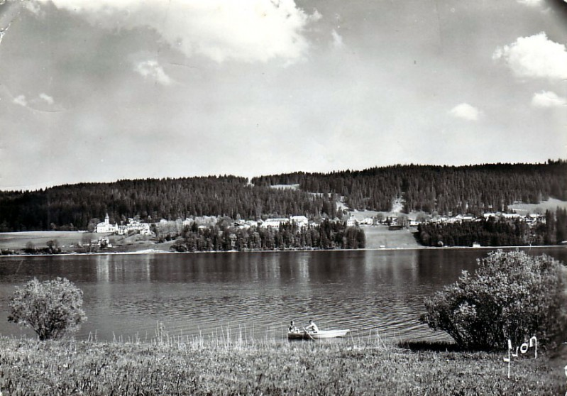
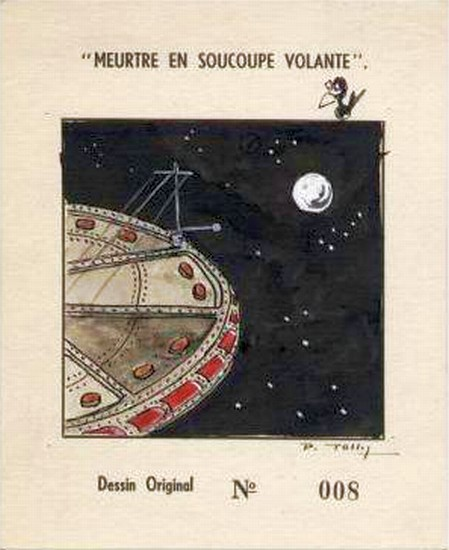

## Bien le bonjour !

Je m'appelle Lili, je suis scientifique en Apprentissage Automatique Appliqués. J'ai travaillé 4 ans chez Berger-Levrault à Toulouse avec une équipe de recherche en Traitement Automatique de la Langue (TAL). En 2024, j'ai pris la tangente direction l'Andalousie pour enseigner le français dans une école primaire.

C'est avec les cigales que j'ai grandi, dans le Midi de la France. Puis, comme le veut la tradition entre deux plats vient le trou normands, c'est donc en Normandie que j'ai étudié et mangé quelques RU. Ensuite, j'ai mis les pieds dans le cassoulet et la tête dans la croustade, en m'installant en Occitanie.

Mon parcours universitaire est un mélange de statistique, d'économie et de sciences informatiques. Et pendant mon temps libre, j'aime visiter des villages, faire du flexy et dessiner.

J'ai créé cet espace pour partager mes analyses en sciences des données, mais aussi les illustrations que je prends beaucoup de plaisir à réaliser au quotidien.

## Le pignouquet

Ce drôle d'oiseau, c'est le corbeau fétiche de Pierre Tollet, auteur et ami de ma mère. Pierre lui écrivait régulièrement des cartes remplies de Pignouquet, pour raconter ses rigolades. Et ma mère les affichait sur les murs de notre maison d'enfance.
La maison n'est plus là, mais le petit piaf, lui, est resté à mes côtés. C'est avec beaucoup d'amour qu'il illustre aujourd'hui mes espiègleries.

#### Quelques mots sur Pierre Tollet

  <!-- Image à gauche -->
  
  

    

  Né en 1909 à Toulon, Pierre vit à Paris jusqu'à la SGM. En 1940, il est fait prisonnier et reste dans un stalag, où il rencontre Jules Chapuzet, avec qui il noue une profonde amitié. 
    
  Après la Libération, en 1945, Pierre rejoint Jules à Malbuisson et fait la connaissance de sa famille. Les parents de Jules tiennent un hôtel, La Fuvelle, construit 40 ans plus tôt, sur les bords du lac Saint-Point.
 
  Pierre tombe sous le charme de la bourgade... et surtout de Lucette, la soeur de son ami, qu'il épouse peu après.
    

  

  Pierre transforme le bar de l'hôtel en salon littéraire pour gourmets bavards. Et dédicace ces livres et corbeaux à ses potos artistes, un verre à la main.

  

    
    
  

  
Sur les bords du lac de lac de Saint-Point à Malbuison, ça sent la Gauloise.

*Ref : archive de BDFI - Pierre Tollet*